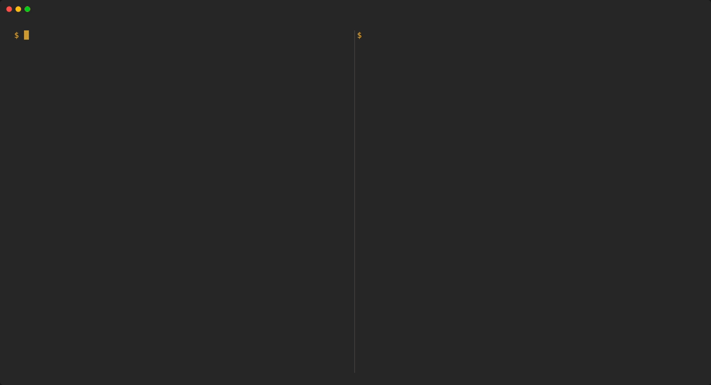

<h1 align="center">rotini</h1>

<p align="center"><strong>A spec-driven codegen package for building CLI programs in Go.</strong></p>

<p align="center">
  <a href="https://github.com/go-rotini/rotini/releases/latest"></a>
  <a href="https://rotini.dev"></a>
  <a href="https://pkg.go.dev/github.com/go-rotini/rotini"></a>
  <a href="LICENSE"></a>
</p>

Rotini lets you describe a command-line program in a JSON schema specification format and generates
a Go program around it. You provide the implementation for what each command does, and rotini
handles the CLI program plumbing. Rather than investing time into writing the plumbing that supports
a Go CLI program, you can focus on writing your program-specific logic. However, rotini does not
enforce its structure and was written with inversion of control and dependency injection in mind;
you can adopt as much or as little of rotini as you want. If you buy in to the lightest commitment
of the framework — the spec-driven codegen model — you can bring your own command routing, parsing,
input handling, help and error reporting, while rotini still generates the command tree, typed
inputs, documentation and shell completion from your spec.

## Rotini in a GIF

Create a Go module, add rotini and run `rotini init`. The program it sets up builds and runs before
you change anything. Then work in the loop. Add a command to the spec and save it, and
`rotini generate --watch` regenerates the code, including the new command's handler stub. Implement
the handler, build and run.

<p align="center">
  
</p>

## Features

| Feature | What you get |
|---|---|
| **Commands** | Sub-commands to any depth, with aliases, help groups and hidden commands. |
| **Flags and arguments** | Short and long flags with GNU-style parsing (`-abc`, `--name=value`, `--no-x`), repeatable flags, and optional and variadic arguments. |
| **Typed values** | Strings, numbers, booleans, lists and maps, plus value types such as `duration`, `date`, `url`, `ip`, `bytesize` and `existingfile`. |
| **Validation** | Required values, defaults, enums, patterns, bounds and lengths, plus flags that are mutually exclusive, required together, one-of or at-least-one, and flags that require others. A bad value is a usage error naming the flag the user typed. |
| **Environment variables** | Any flag can fall back to an environment variable, named from a prefix or set exactly. |
| **Config files** | Values from YAML, JSON, JSONC, TOML or dotenv files at a fixed path or discovered in the XDG config directory or by walking up from the working directory. The command line always wins. |
| **Stdin** | A typed payload piped on stdin, as a JSON, YAML, JSONC or TOML document, as text, or as lines. |
| **Secrets** | Inputs marked secret are redacted from errors and from the record of where each value came from. |
| **Help** | `--help` and `help <command>` pages with usage, examples and see-also links, under headings you can rename, or a page you write yourself. |
| **Version** | `--version` and a `version` command, stamped at build time. |
| **Shell completion** | Scripts for bash, zsh, fish and PowerShell, with completion hints for values such as files and directories. |
| **Man and markdown pages** | Roff man pages and markdown reference pages, ready to install or publish. |
| **Structured output** | A JSON Schema for each command's output and a contract document describing the whole CLI, for scripts and agents. |
| **Errors and exit codes** | Consistent `Error:` messages and a non-zero exit code. Every error carries a usage or internal category you can map to your own exit codes, and errors can be reported as JSON for scripts. |
| **Deprecation** | Deprecated commands, aliases and flags keep working and are marked in help. Each use is reported to your code, which decides whether to warn. |
| **Interrupts and panics** | Ctrl+C and SIGTERM stop the program cleanly, running its teardown, and a second Ctrl+C exits at once. A panic is reported as an error rather than a stack trace. |
| **Suggestions** | "Did you mean" suggestions for a mistyped command, flag or value, opt-in. |
| **Plugins** | Run separate `<app>-<name>` programs as sub-commands, declared or discovered. A rotini program can also be a plugin for kubectl, Docker or Flux, completing and showing help the way the host does. |
| **Wrapper commands** | A command that forwards everything after its name untouched to another program. |
| **Composed CLIs** | Mount one CLI inside another as a sub-command, from the same module or another, while it still builds and ships on its own. |

## Quick start

Requires Go 1.27 or later.

Create a Go module and add the rotini tool to it. `go tool rotini init <name>` then sets up a
working program: a spec and a conf, an entrypoint, a handler for each command, and the generated
code; `go mod tidy` records rotini as a direct dependency, since that code imports it. From there,
development is a loop:
describe a change in the spec (a command, a flag, an input, an output), run `go generate ./...` to
regenerate the typed code, pages and completion, implement the handler for any new command, and
build.

<details>
<summary><strong>Example</strong></summary>

**1. Create a module and add the rotini tool.**

```bash
mkdir helloworld && cd helloworld
go mod init github.com/me/helloworld
go get -tool github.com/go-rotini/rotini/cmd/rotini@latest
```

**2. Set up the program.**

```bash
go tool rotini init helloworld
go mod tidy
```

```
cmd/helloworld/.rotini.spec.yaml     the spec: what the CLI accepts
cmd/helloworld/.rotini.conf.yaml     the conf: what is generated, and where
cmd/helloworld/main.go               the entrypoint
internal/cmd/helloworld/zz_rotini.go generated on every run; do not edit
internal/cmd/helloworld/*.go         one handler per command; yours to edit
```

**3. Declare the command.** Add a `hello` command, with an optional argument and a flag, under
`commands:` in `cmd/helloworld/.rotini.spec.yaml`:

```yaml
    - name: hello
      summary: say hello
      arguments:
        - name: name
          summary: who to greet
          schema: { type: string, default: world }
      flags:
        - name: shout
          summary: greet in capitals
          identifiers: [-s, --shout]
          schema: { type: bool }
```

**4. Generate, then implement the handler.** `go generate ./...` writes
`internal/cmd/helloworld/helloworld_hello.go`. Its `Run` method already reads the typed,
validated inputs (`--help` is answered once, for every command, by the root handler `init`
wrote). Replace the line that prints them with the greeting code:

```go
package helloworld

import (
	"context"
	"fmt"
	"strings"

	"github.com/go-rotini/rotini"
)

var _ rotini.Handler = (*helloworldHelloHandler)(nil)

type helloworldHelloHandler struct {
	rotini.NoCascadingPreRun
	rotini.NoPreRun
	rotini.NoPostRun
	rotini.NoCascadingPostRun
}

func (*helloworldHelloHandler) Run(ctx context.Context, rtx *rotini.Context) {
	inputs, err := rtx.Inputs[HelloworldHelloInputs]()
	if err != nil {
		rtx.HaltWith(err)
		return
	}

	greeting := "Hello, " + inputs.HelloworldHello.Arguments.Name + "!"
	if inputs.HelloworldHello.Flags.Shout {
		greeting = strings.ToUpper(greeting)
	}
	fmt.Fprintln(rtx.Stdout, greeting)
}
```

**5. Build and run.**

```console
$ go build ./cmd/helloworld
$ ./helloworld hello
Hello, world!
$ ./helloworld hello rotini --shout
HELLO, ROTINI!
```

</details>

## Documentation

For more information, see the [rotini](https://rotini.dev) documentation.

- Full API reference is available on [pkg.go.dev](https://pkg.go.dev/github.com/go-rotini/rotini).
- Upgrading: breaking changes are listed in each release's notes; see [UPGRADING.md](UPGRADING.md) for how to upgrade.
- See [CONTRIBUTING.md](CONTRIBUTING.md) for guidelines on how to contribute to this project.
- This project follows a code of conduct to ensure a welcoming community. See [CODE_OF_CONDUCT.md](CODE_OF_CONDUCT.md).
- To report a vulnerability, see [SECURITY.md](SECURITY.md).
- This project is licensed under the MIT License. See [LICENSE](LICENSE) for details.
